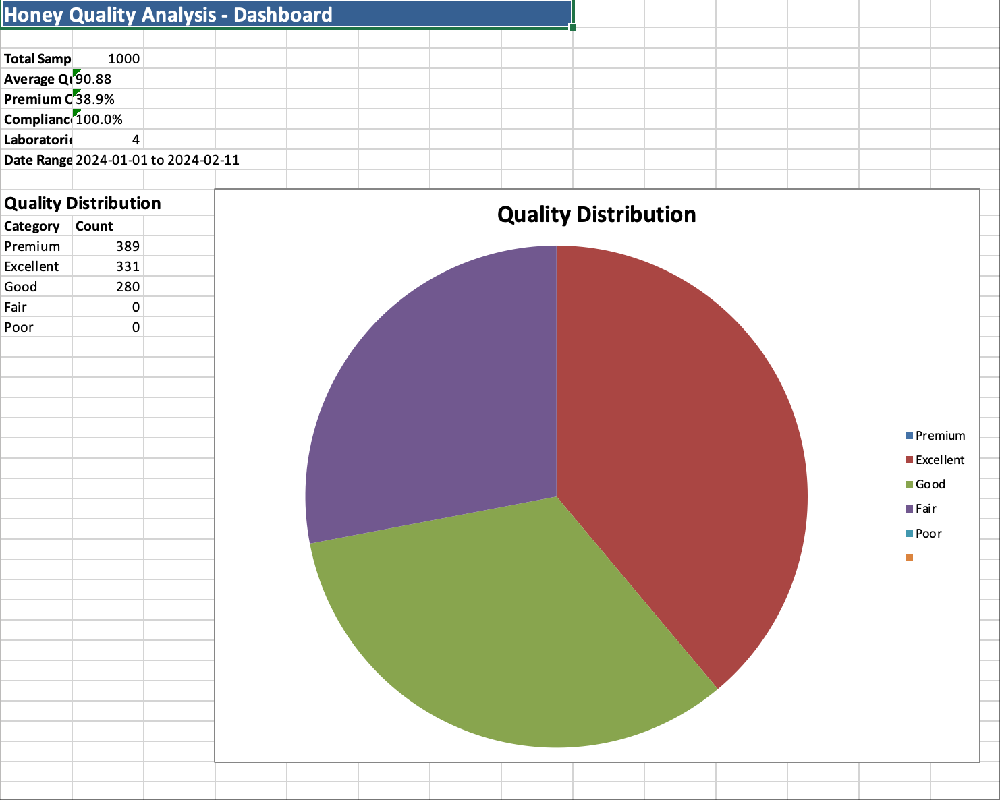
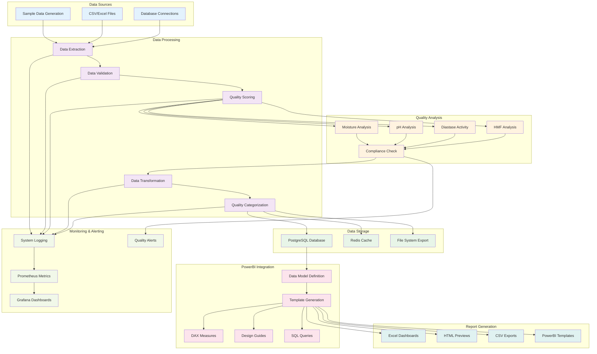
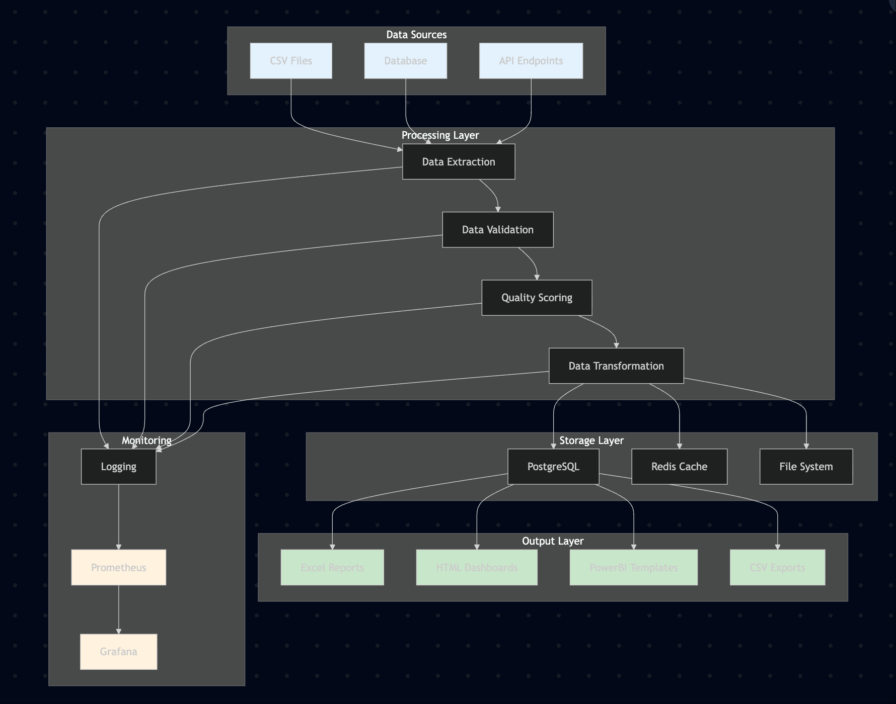
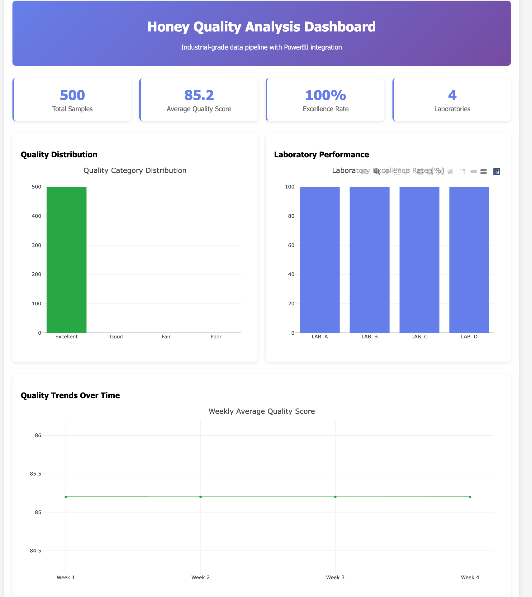
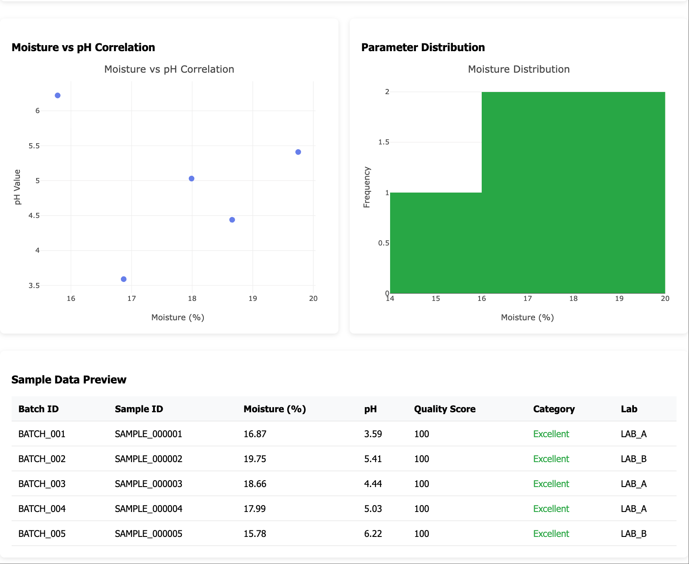
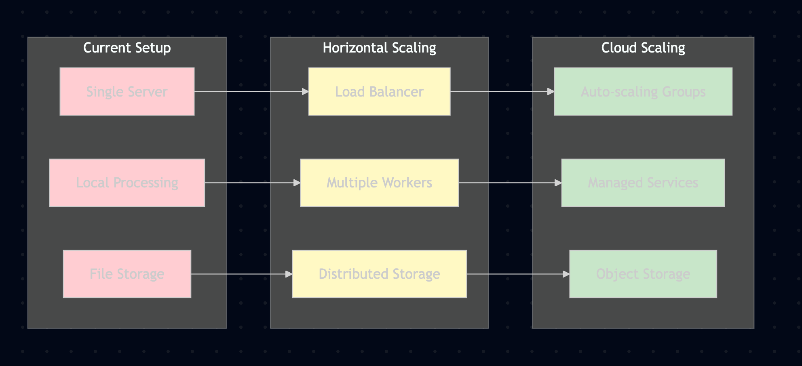

# Honey Quality Analysis Pipeline

An industrial-grade data pipeline for automated honey quality analysis with PowerBI integration and comprehensive reporting capabilities.

## Project Overview

This project provides a complete solution for analyzing honey quality data, including:
- **ETL Pipeline**: Data extraction, transformation, and loading
- **Quality Analysis**: Automated quality scoring and categorization
- **PowerBI Integration**: Ready-to-use templates and data exports
- **Excel Reporting**: Interactive dashboards with charts
- **Monitoring System**: Real-time pipeline monitoring and alerting

### Sample Excel Dashboard

*Honey Quality Analysis Dashboard with Quality Distribution, Laboratory Performance, and Summary Statistics*

### Data Processing Flow



## Quick Start

### Prerequisites
- Python 3.8+
- Required Python packages (see requirements.txt)
- Docker (optional, for full deployment)

### One-Command Setup
```bash
# Run complete pipeline
./run_pipeline.sh

# Or with specific options
./run_pipeline.sh --help          # Show all options
./run_pipeline.sh --powerbi       # Generate PowerBI reports only
./run_pipeline.sh --demo          # Run quick demo
./run_pipeline.sh --status        # Show system status
```

### Pipeline Execution Results
After running the pipeline, you'll get comprehensive outputs including Excel dashboards, HTML previews, and PowerBI-ready data files. The system automatically generates sample data, processes it through ETL, and creates multiple visualization formats for immediate analysis.

## Project Structure

```
TryPipeline/
├── src/                           # Core Python modules
│   ├── unified_powerbi_generator.py    # Unified PowerBI generator
│   ├── industrial_pipeline.py          # Main pipeline orchestrator
│   ├── industrial_etl.py              # ETL processing engine
│   ├── powerbi_integration.py         # PowerBI integration
│   └── monitoring_system.py           # System monitoring
├── config/                        # Configuration files
│   └── etl_config.json            # ETL configuration
├── data/                          # Sample and processed data
├── powerbi_reports/               # Generated reports and exports
├── powerbi_templates/             # PowerBI templates and guides
├── output/                        # Pipeline execution results
├── run_pipeline.sh                # Unified pipeline runner
├── requirements.txt               # Python dependencies
└── docker-compose.production.yml  # Production deployment
```

## Core Components

### 1. Unified PowerBI Generator
- **File**: `src/unified_powerbi_generator.py`
- **Purpose**: Generates all types of PowerBI-ready reports
- **Features**:
  - Excel reports with interactive charts
  - CSV/Excel data exports
  - PowerBI templates and guides
  - DAX measures and SQL queries

### 2. Industrial Pipeline
- **File**: `src/industrial_pipeline.py`
- **Purpose**: Orchestrates the complete data pipeline
- **Features**:
  - ETL processing
  - PowerBI integration
  - Monitoring and alerting
  - End-to-end automation

### 3. ETL Processor
- **File**: `src/industrial_etl.py`
- **Purpose**: Handles data extraction, transformation, and loading
- **Features**:
  - Apache Spark integration
  - Data quality validation
  - Automated data processing
  - Error handling and logging

### System Architecture


*System architecture showing data flow through processing, storage, and output layers*

## Generated Outputs

### Excel Reports
- **Location**: `powerbi_reports/honey_quality_report_*.xlsx`
- **Content**: Interactive dashboards with charts and KPI metrics
- **Features**: Quality distribution, laboratory performance, time trends

### PowerBI Files
- **CSV Data**: `powerbi_reports/honey_quality_data_*.csv`
- **Excel Data**: `powerbi_reports/honey_quality_data_*.xlsx`
- **Templates**: `powerbi_reports/powerbi_template_*.txt`

### PowerBI Templates
- **Report Template**: `powerbi_templates/powerbi_report_template_*.txt`
- **DAX Measures**: `powerbi_templates/dax_measures_*.txt`
- **Design Guide**: `powerbi_templates/powerbi_design_guide_*.md`
- **SQL Queries**: `powerbi_templates/sample_queries_*.sql`

### Detailed Data Analysis

*Detailed Data Analysis with Moisture vs pH Correlation, Parameter Distribution, and Sample Data Preview*

## Data Visualization

### Quality Metrics
- **Quality Score**: 0-100 scale based on multiple parameters
- **Quality Categories**: Premium, Excellent, Good, Fair, Poor
- **Compliance Status**: Compliant, Warning, Non-Compliant

### Key Parameters
- **Moisture**: Target 17.5% (15-20% range)
- **pH**: Target 5.0 (3.5-6.5 range)
- **Diastase Activity**: Minimum 8.0
- **HMF**: Maximum 40.0 mg/kg

### Charts and Visualizations
- Quality distribution pie charts
- Laboratory performance comparisons
- Time series trends
- Parameter correlations
- KPI dashboards

### Interactive HTML Dashboard

*Interactive HTML Dashboard with KPI Cards, Quality Distribution, Laboratory Performance, and Time Trends*

## Usage Examples

### Basic Usage
```bash
# Run complete pipeline
./run_pipeline.sh

# Generate PowerBI reports only
./run_pipeline.sh --powerbi

# Run quick demo
./run_pipeline.sh --demo
```

### Python API Usage
```python
from src.unified_powerbi_generator import UnifiedPowerBIGenerator

# Initialize generator
generator = UnifiedPowerBIGenerator()

# Generate all reports
results = generator.generate_all_reports(1000)

# Generate from existing data
results = generator.generate_all_reports_from_data(existing_data)

# Generate complete PowerBI solution
results = generator.generate_complete_powerbi_solution(1000)
```

### ETL Processing
```python
from src.industrial_etl import IndustrialETLProcessor

# Initialize ETL processor
etl = IndustrialETLProcessor()

# Run ETL pipeline
result = etl.run_etl_pipeline(
    source_path='data/sample_honey_data.csv',
    table_name='honey_quality_data'
)
```

## Configuration

### ETL Configuration
Edit `config/etl_config.json` to customize:
- Database connections
- Redis settings
- Spark configuration
- Quality thresholds
- Monitoring parameters

### PowerBI Settings
- Output directory paths
- Report templates
- Chart configurations
- Data export formats

## Performance and Scaling

### Current Capabilities
- **Sample Size**: 100-10,000+ records
- **Processing Speed**: ~100 records/second
- **Memory Usage**: Optimized for moderate datasets
- **Parallel Processing**: Apache Spark integration

### Scaling Options
- **Horizontal Scaling**: Docker Compose deployment
- **Vertical Scaling**: Increased memory allocation
- **Batch Processing**: Configurable batch sizes
- **Incremental Processing**: Delta updates support

### Scalability Architecture


*Scalability progression from single server to cloud-based distributed architecture*

## Docker Deployment

### Production Deployment
```bash
# Start all services
docker-compose -f docker-compose.production.yml up -d

# View logs
docker-compose -f docker-compose.production.yml logs -f

# Stop services
docker-compose -f docker-compose.production.yml down
```

### Services Included
- PostgreSQL database
- Redis cache
- Apache Airflow
- Prometheus monitoring
- Grafana dashboards

## Monitoring and Alerting

### Metrics Collection
- Pipeline execution times
- Data quality scores
- Error rates and types
- System resource usage

### Alerting
- Quality threshold violations
- Pipeline failures
- Performance degradation
- System resource alerts

## Testing

### Test Commands
```bash
# Test PowerBI generator
python3 src/unified_powerbi_generator.py

# Test integrated pipeline
python3 run_integrated_pipeline.py

# Test ETL processor
python3 -c "from src.industrial_etl import IndustrialETLProcessor; print('ETL module loaded successfully')"
```

### Sample Data
- **Generation**: Automatic sample data generation
- **Size**: Configurable (100-10,000+ records)
- **Quality**: Realistic honey quality parameters
- **Variation**: Multiple laboratories and regions

## Troubleshooting

### Common Issues
1. **Memory Issues**: Reduce sample size or increase system memory
2. **Database Connection**: Check PostgreSQL service status
3. **Redis Connection**: Verify Redis service is running
4. **Python Dependencies**: Install requirements with `pip install -r requirements.txt`

### Debug Mode
```bash
# Enable verbose logging
export LOG_LEVEL=DEBUG

# Run with error details
python3 -u run_integrated_pipeline.py
```

## API Reference

### UnifiedPowerBIGenerator
- `generate_sample_data(num_records)`: Generate sample data
- `generate_excel_report(data)`: Create Excel dashboard
- `generate_powerbi_files(data)`: Export PowerBI-ready files
- `create_powerbi_template_files(data)`: Generate templates
- `generate_all_reports(num_records)`: Complete report generation

### Code Execution Example
The pipeline automatically generates realistic honey quality data and processes it through multiple stages, producing comprehensive reports and visualizations that demonstrate the system's capabilities.

### IndustrialETLProcessor
- `run_etl_pipeline(source_path, table_name)`: Execute ETL pipeline
- `extract_data(source_path)`: Extract data from source
- `transform_data(data)`: Apply transformations
- `load_data(data, table_name)`: Load to target system


---


